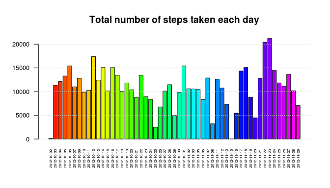
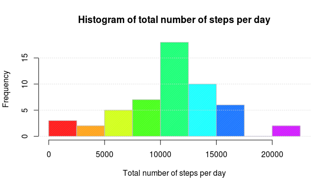
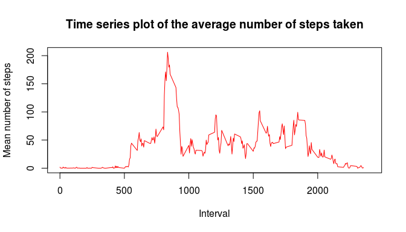
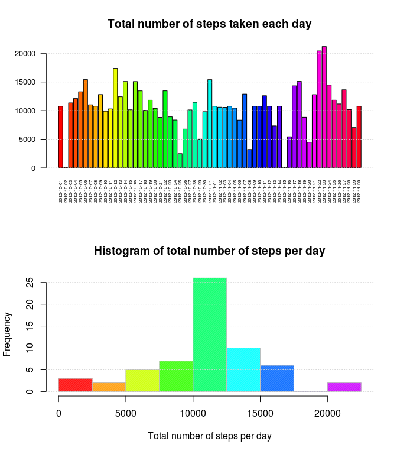
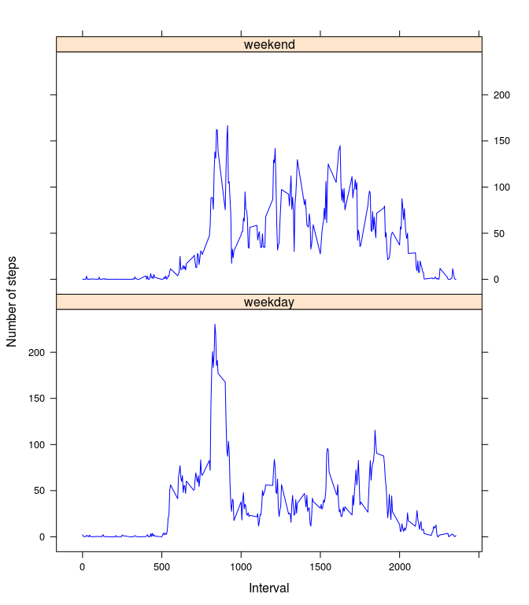

## Note
Before running the script, set working directory to the one containing Rmd file.

## Loading and preprocessing the data
Unzip and load the data into activity dataset.

Discard missing values in defactivity dataset and building the date factor column again with actual values.

```r
unzip(paste(getwd(), "activity.zip", sep = "/"))
activity <- read.csv("activity.csv")
defactivity <- activity[!is.na(activity$steps), ]
defactivity$date <- as.factor(as.Date(defactivity$date))
```

## Histogram of the total number of steps taken each day
Calculate the array of the total number of steps per day (totalstepsperday)

```r
totalstepsperday <- with(defactivity, tapply(steps, date, sum, na.rm = T))
```

First we plot a barplot of total number of steps per day

```r
par(mfrow = c(1, 1))
barplot(totalstepsperday, space = 0.2, cex.names = 0.5, col = rainbow(61), las = 2,
        cex.axis = 0.8, main = "Total number of steps taken each day")
grid(nx = NA, ny = NULL)
```

<!-- -->

Then we plot the actual histogram of total number of steps per day

```r
hist(totalstepsperday, breaks = seq(from = 0, to = 22500, by = 2500),
     col = rainbow(10), border = "grey", density = 100,
     main = "Histogram of total number of steps per day",
     xlab = "Total number of steps per day")
grid(nx = NA, ny = NULL)
```

<!-- -->

We can check, for example, the number of days with more than 20000 steps (2) regarding the previous plot.

## What is mean total number of steps taken per day?
We use the mean and median function on the totalstepsperday array

```r
meanstepsnumber <- as.character(round(mean(totalstepsperday), digits = 2))
medianstepsnumber <- as.character(round(median(totalstepsperday), digits = 2))
```
The mean number of steps taken per day is **10766.19**.

The median number of steps taken per day is **10765**.

## What is the average daily activity pattern?
### Time series plot of the average number of steps taken

```r
dd <- defactivity
dd$interval <- as.factor(dd$interval)
meanstepsperinterval <- with(dd, tapply(steps, interval, mean))
plot(names(meanstepsperinterval), meanstepsperinterval, col = "red", pch = 18,
     xlab = "Interval", ylab = "Mean number of steps",
     main = "Time series plot of the average number of steps taken", type = "l",
     xlim = c(0, 2400))
```

<!-- -->

## The 5-minute interval that, on average, contains the maximum number of steps

```r
meanstepsperinterval <- with(defactivity, tapply(steps, interval, mean, na.rm = T))
maxmeanstepsperinterval <- max(meanstepsperinterval)
intervalmaxmeanindex <- which(meanstepsperinterval == maxmeanstepsperinterval)
intervalmaxmean <- names(meanstepsperinterval)[intervalmaxmeanindex]
immSTR <- strsplit(as.character(intervalmaxmean), "")[[1]]
immH <- paste(ifelse(length(immSTR)>2, immSTR[1], "0"), " H", sep = "")
immMd <- ifelse(length(immSTR)>2, immSTR[2], ifelse(length(immSTR)>1, immSTR[1], "0"))
immMu <- ifelse(length(immSTR)>2, immSTR[3], ifelse(length(immSTR)>1, immSTR[2], immSTR[1]))
immM <- paste(immMd, immMu, " mn", sep = "")

intervalmaxmeanHM <- paste(immH, immM, sep = " ")
```
The 5-minute interval that, on average, contains the maximum number of steps is **835** (**8 H 35 mn**) - mean total number of steps for this interval : *206.17*


## Imputing missing values
### Number of missing values

```r
nbofmissingdata <- length(activity$steps[which(is.na(activity$steps))])
```
The number of missing data is **2304**.

A quick look on where values are missing. Display a table with the count of missing value per day with missing values.

```r
patternofmissingdata <- with(activity, tapply(steps, date, function(x) {
    length(which(is.na(x)))
}))
tt <- patternofmissingdata[which(patternofmissingdata>0)]
tt
```

```
## 2012-10-01 2012-10-08 2012-11-01 2012-11-04 2012-11-09 2012-11-10 
##        288        288        288        288        288        288 
## 2012-11-14 2012-11-30 
##        288        288
```

```r
nbofdayswithmissingvalues <- length(tt)
```
There are 8 days with missing values.

### Impute missing values
We choose to impute the mean per interval calculated with non empty data to the non available data.

We calculate the mean of total steps per interval

```r
meanstepsperinterval <- with(defactivity, tapply(steps, interval, mean))
```
Then we create an index of missing values.

```r
imputedactivitymeaninterval <- activity
missingIndex <- which(is.na(imputedactivitymeaninterval["steps"]))
```
And, using this index, we set each value with appropriate mean value for current interval

```r
for (i in missingIndex) {
    imputedactivitymeaninterval[i, "steps"] <- meanstepsperinterval[as.character(imputedactivitymeaninterval[i, "interval"])]
}
```
### Barplot and histogram of total number of steps per day, with imputed data

```r
totalstepsperdayimp <- with(imputedactivitymeaninterval, tapply(steps, date, sum, na.rm = T))
par(mfrow = c(2, 1))
barplot(totalstepsperdayimp, space = 0.2, cex.names = 0.5, col = rainbow(61), las = 2,
        cex.axis = 0.8, main = "Total number of steps taken each day")
grid(nx = NA, ny = NULL)
hist(totalstepsperdayimp, breaks = seq(from = 0, to = 22500, by = 2500),
     col = rainbow(10), border = "grey", density = 100,
     main = "Histogram of total number of steps per day",
     xlab = "Total number of steps per day")
grid(nx = NA, ny = NULL)
```

<!-- -->

### Mean and median with imputed data

```r
meanstepsnumberimp <- as.character(round(mean(totalstepsperdayimp), digits = 2))
medianstepsnumberimp <- as.character(round(median(totalstepsperdayimp), digits = 2))
```
With imputed missing values, the mean number of steps taken per day is **10766.19**.
Without considering missing values, the mean number of steps taken per day is **10766.19**.

The median number of steps taken per day is **10766.19**.
Without considering missing values, the median number of steps taken per day is **10765**.

With imputed missing value, mean stays the same (obviously), median is slightly higher.

## Are there differences in activity patterns between weekdays and weekends?
### Add a factor column for weekday / weekend
Instead of using weekdays (depends on language / culture), we use the number of day in week, given by as.POSIXlt(...)$wday

```r
imputedactivitymeaninterval$wkd <- ifelse(as.POSIXlt(imputedactivitymeaninterval$date)$wday %in% 1:5, "weekday", "weekend")
imputedactivitymeaninterval$wkd <- as.factor(imputedactivitymeaninterval$wkd)
```
Shape the data for lattice plotting, using reshape2 library

```r
library(reshape2)
imputedactivitymeanintervalMelt <- melt(imputedactivitymeaninterval,
                        id = c("wkd", "interval"), measure.vars = c("steps"))
emData <- dcast(imputedactivitymeanintervalMelt, interval + wkd ~ variable, mean)
```
Plot the two graphs (weekend / weekday) one above the other using lattice library

```r
library(lattice)
g <- xyplot(steps ~ interval | wkd, data = emData, main = "", ylab = "Number of steps",
       xlab = "Interval", cex = 1, col = "blue", horizontal = FALSE, type = "l",
       index.cond = list(c(1, 2)))
g <- update(g, layout = c(1, 2))
plot(g)        
```

<!-- -->

There is a difference between weekdays and weekend days : the pike on 8h35 is not as high on weekend days as on weekdays.
Another difference is for example the earlier beginning of steps in weekdays (5h).
